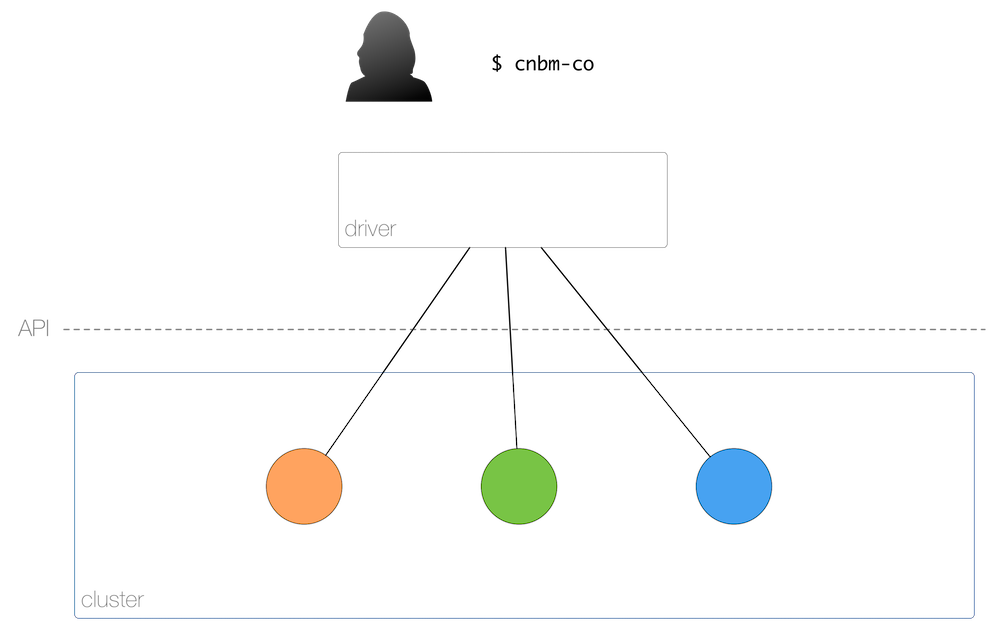

# Design Of Thee Container Orchestration Benchmark

This document discusses the CNBM-CO benchmark design and how we got there as well as related efforts.

The benchmark is executed as follows (cf also above architecture):

1. User provisions the cluster and provides a running cluster to the benchmark.
1. Benchmark itself runs in the the cluster, triggered by the local `cnbm-co` command.
1. Results are dumped to stdout as CSV/JSON, locally.

## Targets

Supported targets at the moment are:

- [DC/OS 1.9.2](https://dcos.io/releases/1.9.2/)
- [Kubernetes 1.7.2](https://github.com/kubernetes/kubernetes/releases/tag/v1.7.2)

## Benchmark run types

The CNBM-CO benchmark is composed of a number of micro-benchmarks, called *benchmark run types* (or simply run types) which are covering different areas.

### `scaling`

The following sequence:

1. Start `N` containers in `seconds` potentially with different runtimes (Docker, UCR, CRI-O).
1. Stop `N` containers in `seconds`.

### `distribution`

Launches `N` containers and measures the distribution over nodes in `map: nodeid -> set of containers`.

### `apicalls`

Measures API calls from within cluster in `seconds`:

- list containers
- list pods
- list services/endpoints

### `servicediscovery`

Measure service discovery in `seconds`:

- Start a service and measure how long it takes until it can be discovered from different nodes.
- How long does a query/look-up take (while scaling services)?

### `recovery`

Recovery performance in case of re-scheduling a pod/ (container) in  `seconds`.

## Dimensions

For individual run types we consider one or more of the following dimensions:

- Number nodes, that is, worker nodes that are hosting containers.
- Number of containers.
- Container runtime type (Docker, UCR, CRI-O).
- Failure rate (per container, nodes, network).

## Related Work

While no prior art exists that has the same scope as the CNBM-CO benchmark there are a number of (related) efforts we reviewed and learned from:

- [Scheduler Performance Test](https://docs.google.com/presentation/d/1HYGDFTWyKjJveAk_t10L6uxoZOWTiRVLLCZj5Zxw5ok), by Hongchao Deng and Xiang Li (Kubernetes SIG Scale)
- The Cloud Container Cluster Common Benchmark [allingeek/c4-bench](https://github.com/allingeek/c4-bench)
- A Go-based framework for [running benchmarks against Docker, containerd, and runc engine layers](https://github.com/estesp/bucketbench)
- From the Kubernetes blog: [1000 nodes and beyond: updates to Kubernetes performance and scalability in 1.2](http://blog.kubernetes.io/2016/03/1000-nodes-and-beyond-updates-to-Kubernetes-performance-and-scalability-in-12.html)
- [OpenShift v3 Scaling, Performance and Capacity Planning](https://access.redhat.com/articles/2191731) and the `openshift/svt` [cluster-loader](https://github.com/openshift/svt/tree/master/openshift_scalability)
- [Deploying 1000 nodes of OpenShift on the CNCF Cluster (Part 1)](https://www.cncf.io/blog/2016/08/23/deploying-1000-nodes-of-openshift-on-the-cncf-cluster-part-1)
- From the CoreOS blog: [Exploring Performance of etcd, Zookeeper and Consul Consistent Key-value Datastores](https://coreos.com/blog/performance-of-etcd.html)
